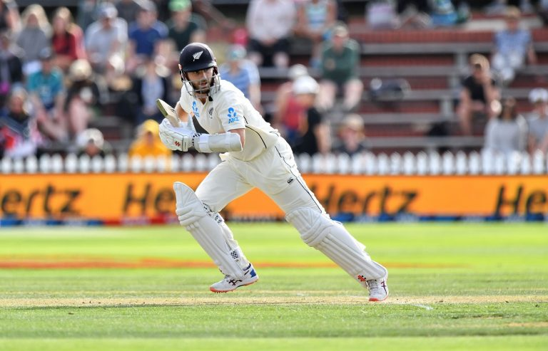
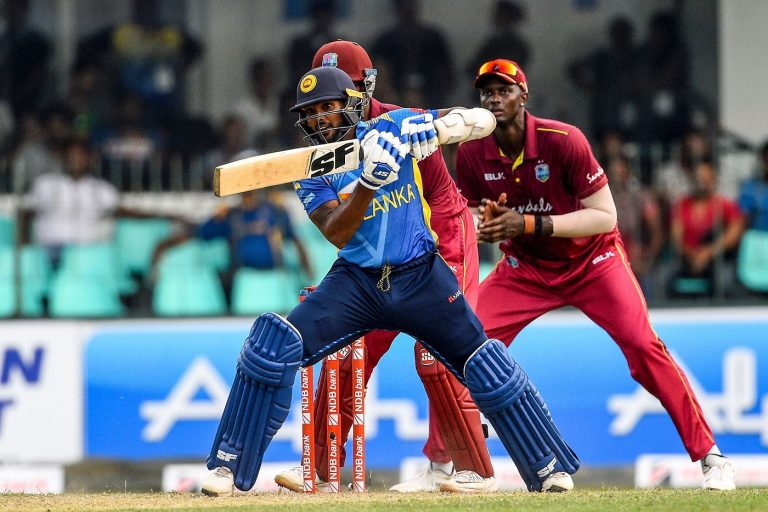
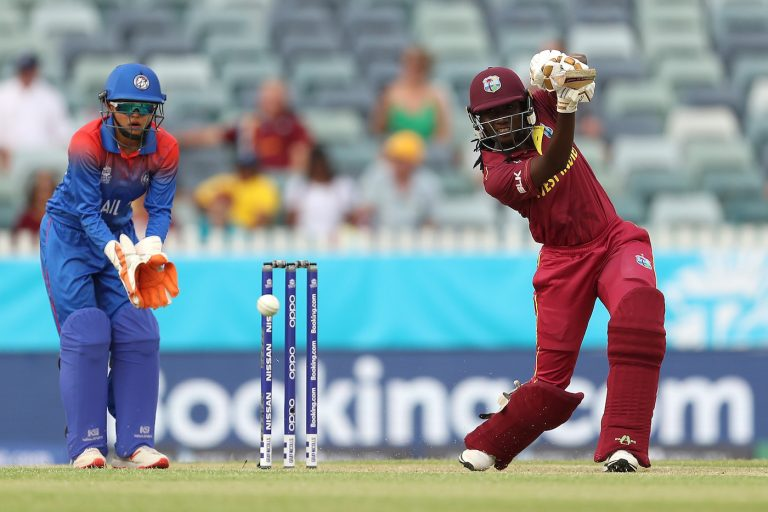

A total of 5 international cricket matches were played out today in 4 different countries across all 3 formats and 2 genders. Here is a round up of all of them.

## Men’s Test Matches
### New Zealand v India, 1st Test, Day 2

*Photo – Getty Images*

India resumed the day at their overnight score of 122/5. Rishabh Pant started off with a bang – slamming a six in the very first over, but was soon runout following a mix up with Rahane and a direct hit from Ajaz Patel. Tim Southee ran through the remaining batting in quick time and India were bowled out for 165 – their lowest first innings total in the last 18 months.

New Zealand further drove home the advantage on the back of Kane Williamson’s fine 89 as they finished the day 51 runs ahead of the visitors with 5 wickets still in hand. Ishant Sharma was the only Indian bowler who impressed consistently and finished the day with 3 wickets to his name.

**India 165** (Rahane 46, Jamieson 4/39, Southee 4/49) trail **New Zealand 216/5** (Williamson 89, Taylor 44, Ishant 3/31) by 51 runs

### Bangladesh v Zimbabwe, Only Test, Day 1

*Photo – BCB*

Zimbabwe won the toss and elected to bat first, but struggled big time in the first half an hour – scoring just 7 runs and losing a wicket in the first 8 overs. Captain Craig Ervine vindicated his decision to bat first as he was involved in a century partnership with Prince Masvaure. However, once Masvure departed, Bangladesh kept chipping away at regular wickets, and the wicket of the captain and centurion Ervine in the penultimate over of the day handed the home team the edge. Nayeem Hasan had a busy day, bowling as many as 36 overs, and scalping 4 wickets, including that of Ervine.

*Zimbabwe 228/6* (Ervine 107, Masvaure 64, Hasan 4/68) vs *Bangladesh*

## Men’s ODIs
### Sri Lanka v West Indies, 1st ODI

*Photo – Getty Images*

Yet another Shai Hope hundred alongside contributions from Darren Bravo and Roston Chase, and some late pyrotechnics from Keemo Paul and Hayden Walsh Jr took West Indies to a rather decent 289/7 in their quota of 50 overs. Hope now has 6 hundreds in 15 ODI innings in Asia at an incredible average of 123!

Sri Lanka looked to be coasting with an opening partnership of 111 between Avishka Fernando and captain Karunarathane. However, once Holder sent Karunarathane back, Sri Lanka kept losing wickets at regular intervals and found themselves gasping for breath at 262/8 – still 28 short of the target. Some spunky boundaries from Hasaranga, while Sandakan hung in, left Sri Lanka with just one run to get in the last over.

But the game was far from done. A direct hit from Sunil Ambris found Sandakan short as Sri Lanka tried to steal a single that would have given them a win. With one run needed and only one wicket in hand, Keemo Paul ended up delivering a full toss above waist that was called a no ball, ending the game in an anti-climax.

**West Indies 289/7 in 50 overs** (Hope 115, Chase 41, Udana 3/82) lost to **Sri Lanka 290/9 in 49.1 overs** (Karunarathane 52, Fernando 50, K Perera 42, Joseph 3/42) by 1 wicket

## Women’s T20 World Cup
### Thailand v West Indies

*Photo – Getty Images*

A team from Thailand at a Cricket World Cup. The Thai women rose to the occasion and though the result may seem to have been comprehensively against them, they had their moments and did look a part in patches. A steady hand from wicket-keeper Koncharoenkai, batting at 3, saw the team from South-East Asia reach a respectable 46/2 at the end of the 11th over. However, some tight bowling from the West Indies and obvious inexperience from the Thai saw them collapse and finish with a well-below-par 78/9.

The Thai weren’t done yet. They had strived to reach this stage, and wanted to be noticed. And noticed they were as they made the West Indies sweat it out by keeping things tight. They were justly rewarded for being efficient in the field too as a couple of runouts saw the Windies slip to 27/3 in the 7th over. An outlandish upset did loom over the horizon then. However, skipper Taylor, and keeper Campbelle kept their composure and calmly took the highly favoured side over the line comfortably.

**Thailand 78/9 in 20 overs** (Koncharoenkai 33, Taylor 3/13) lost to **West Indies 80/3 in 16.4 overs** (Taylor 26*, Campbelle 25*, Lateh 1/21) by 7 wickets

### New Zealand v Sri Lanka

*Photo – Getty Images*

Captain Chamari Athapaththu once again got Sri Lanka off to a rollickling start. The left hander took the attack to the Kiwi medium pacers as Sri Lanka raced off to 51/0 in the powerplay. The end of the field restrictions helped New Zealand put a lid on the scoring rate as the runs dried up from the other side. By the time Athapaththu fell, chipping a return catch to Tahuhu, Sri Lanka were 87/2 in the 12th over, and still in a very respectable position. However, the Lankan batters failed to make the most of the platform made available to them as none of them, with the exception of Madavi, made more than 4. The Lankans finished with 127/7.

Given that the average score batting first at the venue in the recently concluded WBBL was 133, the Lankans were still in with more than just a chance, and they looked up to it. The Kiwis struggled to put the ball in the gaps and the frustration led to Priest getting runout in the 5th over. It could have been worse for the Kiwis had Madavi, who had run Priest out, held on to a regulation catch of Bates, who was on 0 then, in the slips. The Kiwis finished the powerplay at 25/1, and the frustration showed on both of New Zealand’s best batters – Bates and Devine. Devine too offered a chance, trying to hit her way out of trouble, and skying one high in the air, only for it to be put down as well.

Bates didn’t last long, but by the time she fell, Devine had spent more than enough time in the middle and found her groove. Green replaced Bates in the 11th over and took the attack to the Sri Lankans immediately. Her 61 run association with Devine came up in just 36 balls and snatched the game away from Sri Lanka. Devine, who had scored 22 runs off her first 28 balls, scored 53 off the next 27, and finished unbeaten on 75.

**Sri Lanka 127/7 in 20 overs** (Athapaththu 41, Madavi 27*, Jensen 3/16, A Kerr 2/21) lost to **New Zealand 131/3 in 17.4 ov**(Devine 75*, Green 29) by 7 wickets.